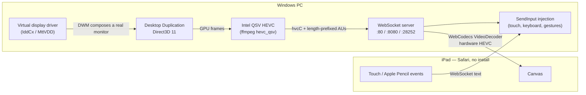

# OpenWinSidecar

<div align="center">

[](LICENSE)
[](https://dotnet.microsoft.com/)
[]()
[]()
[]()

**An open-source Windows virtual display that streams to your iPad's browser — no client app, no subscription.**

Turn an iPad into a real extra Windows monitor: true "Extend display" via a virtual display driver, hardware H.265 streaming, full touch and keyboard input — straight from Safari. Tested on **Windows 11 with an Intel GPU**; it should work elsewhere too (other Windows versions, other GPUs, other browsers) — but you're the tester there, so please open an issue and let me know how it goes.

[Quick start](#quick-start) · [How it works](#how-it-works) · [Why this exists](#why-this-exists) · [Features](#features) · [Architecture](docs/architecture.md) · [Troubleshooting](docs/troubleshooting-and-faq.md)

</div>

---

## Why this exists

I wanted to use my iPad as a second screen on Windows. I looked at what was available and didn't like the options — closed-source, subscription-priced, CPU-hungry, or all three — so I built my own.

The core idea is simple: **an iPad already has a great hardware video decoder and a great screen — Safari just needs the right bytes.** So this streams a *real Windows virtual display* (a genuine extend-mode monitor, not a mirror) to Safari using hardware HEVC and WebCodecs, with input injection back into Windows. No App Store download, no per-feature subscription, no opaque binaries.

| | OpenWinSidecar | Sidecar | Commercial Windows tools |
|---|---|---|---|
| Extra monitor (extend, not mirror) | ✅ | ✅ | ✅ |
| Client install | **None — Safari** | iPad built-in | App + account |
| Hardware H.265 end-to-end | ✅ Intel QSV → Apple silicon | ✅ | varies |
| Open source / self-hosted | ✅ AGPL-3.0 | ❌ | ❌ |
| Touch → Windows input | ✅ | ✅ (Mac only) | ✅ |
| Cost | free | needs a Mac | subscription |

## Quick start

**You need:** a Windows 10/11 PC, the .NET 10 SDK, an iPad (or any modern browser) on the same network — plus the two one-time installs below.

### 1. Install the virtual display driver (once, as Administrator)

Right-click `drivers/VDD/install_driver.bat` → **Run as administrator**. This creates the real extra monitor that Windows will extend onto. No reboot needed. If the display doesn't appear, see [drivers-and-virtual-monitors.md](docs/drivers-and-virtual-monitors.md).

### 2. Install FFmpeg (once)

```powershell
winget install --id Gyan.FFmpeg -e
```

Take the full build, not Essentials — the hardware HEVC encoder needs it. The app finds it on PATH by itself; if you just installed it, open a fresh terminal first.

### 3. Build and run

```powershell
git clone https://github.com/julianmb/OpenWinSidecar.git
cd OpenWinSidecar
dotnet build OpenWinSidecar.slnx
dotnet run --project src/OpenWinSidecar
```

(Or run `run_console.bat` after building.) The streaming service needs elevation for GPU capture — use `run_service_admin.bat` if it asks — and Windows Firewall may prompt on first launch; allow it on private networks.

### 4. Connect the iPad

**Scan the QR code** shown in the console (or open `http://<your-pc-ip>:8080` in Safari) → Share → **Add to Home Screen** for a borderless fullscreen experience. Windows now has an extra display in Settings, and the iPad shows it — move windows onto it like any monitor.

## How it works



Three pieces make it interesting:

1. **A *real* virtual monitor.** The driver (IddCx) presents an actual display to Windows — apps see a genuine monitor with its own resolution and DPI, windows can be maximized onto it, and the desktop *aspect-matches the iPad* automatically so the stream fills the screen with no black bars.
2. **Hardware end-to-end.** Frames never touch the CPU on the capture path (Direct3D 11 Desktop Duplication straight from GPU VRAM), and encoding runs on the Intel GPU's dedicated QSV block — a 2560×1440 desktop encodes in single-digit milliseconds. On the iPad, Safari's WebCodecs decoder hands frames to the same silicon Apple uses for video playback.
3. **A protocol small enough to read in an afternoon.** WebSocket binary packets with a 15-byte header; access authentication with SHA-256 challenge-response; per-client encoders so clients always join on a clean keyframe; idle frames skipped entirely (a static desktop costs ~0 bandwidth). The whole wire format fits in [one documented page](docs/network-and-discovery.md).

## Features

- **Extend, not mirror** — a genuine additional display with its own resolution; aspect-matched to the connecting device
- **Hardware HEVC** (H.265) streaming with automatic JPEG fallback — works on any browser, flies on Apple silicon
- **Full input**: touch tap/drag, two-finger scroll, two-finger tap = right-click, on-screen keyboard, physical-keyboard forwarding (layout-stable `e.code` mapping)
- **Multi-monitor intelligence**: resolution presets for every iPad generation, Windows DPI scaling (100–225%) adjustable live from the iPad
- **Fan-out architecture** — one capture loop per display serves any number of clients; slow clients drop frames instead of adding latency
- **Optional access password** — challenge-response authenticated, off by default
- **Zero-install client** — Safari (or Chrome/Firefox/Edge), Add to Home Screen for the full-screen PWA
- **Console app** with QR-code connect, live status, service/driver lifecycle management, and a system tray

## Performance characteristics

Measured on a test system (Intel Arc A380, 2560×1440 virtual display, wired LAN):

| Path | What you get |
|---|---|
| Capture (DXGI Desktop Duplication) | < 1 ms per frame, GPU-resident |
| HEVC encode (QSV) | single-digit ms; ~5 Mbps class bitrate |
| JPEG fallback | ~55 fps at 1180-wide, universal compatibility |
| Idle desktop | near-zero bandwidth (unchanged frames are not re-sent) |
| Multi-client | two iPads ≈ 48 fps each, independent streams |

Latency is dominated by network + display pipeline; on a healthy Wi-Fi network the experience is fluid desktop use. On-device iPad HEVC validation is the current focus — see the [troubleshooting guide](docs/troubleshooting-and-faq.md) if your Safari falls back to JPEG.

## Project layout

```
src/
  OpenWinSidecar.Core      # display/driver/services management, Win32 interop
  OpenWinSidecar.Service   # capture, encoding, WebSocket server, web client
  OpenWinSidecar           # WPF management app + tray + QR connect
  OpenWinSidecar.Cli       # command-line management
drivers/VDD/               # virtual display driver package (IddCx)
docs/                      # architecture, protocols, troubleshooting
```

## Device support

The server is browser-agnostic — anything with a modern browser can connect. Tested combination: **Windows 11 + Intel GPU (Quick Sync) → iPad Safari**. Everything else below is expected to work based on standards support, with the codec chosen automatically per device (hardware HEVC where available, JPEG otherwise) — if you run one of these, open an issue and tell me how it went so the row can move to ✅.

| Device / browser | Status | Video path |
|---|---|---|
| **iPad — Safari** (any recent) | ✅ **Tested** | Hardware HEVC (with JPEG fallback) |
| **iPhone — Safari** | 🔶 Untested, expected to work | Hardware HEVC |
| **Mac — Safari** | 🔶 Untested, expected to work | Hardware HEVC |
| **Android tablet/phone — Chrome** | 🔶 Untested, expected to work | HEVC on modern hardware, else JPEG |
| **Windows/Linux laptop — Chrome/Edge** | 🔶 Untested, expected to work | HEVC where the GPU supports it, else JPEG |
| **Firefox (any platform)** | 🔶 Untested | JPEG fallback (no WebCodecs HEVC yet) |

The client probes `VideoDecoder.isConfigSupported` on connect and picks the codec per device — no failed-codec stall. Reports from other devices are very welcome; the goal is to move rows to ✅ as they're confirmed.

## Limitations & status

- **Windows-only server** (the driver and capture stack are inherently Win32); clients are anything with a browser. Tested on **Windows 11** — Windows 10 should work, unconfirmed
- Hardware encoding is proven on **Intel Quick Sync** (Arc / Iris Xe / integrated graphics); NVIDIA (NVENC) and AMD (AMF) paths exist in code but are unvalidated — try them and report back
- Audio streaming, Apple Pencil pressure, and AV1 are on the roadmap, not yet implemented
- The virtual display driver is MikeTheTech's [Virtual Display Driver](https://github.com/itsmiketyy/VirtualDisplayDriver) — the driver itself is bundled under `drivers/VDD` (MIT-licensed project, driver files retain their own terms). The upstream control-panel GUI is not bundled (163 MB); grab it from their releases if you want it — the app manages the driver on its own

## Contributing

See [CONTRIBUTING.md](CONTRIBUTING.md). The codebase is C# / .NET 10 with Win32 interop concentrated in small, documented P/Invoke surfaces — a good place to start is the [architecture guide](docs/architecture.md) and the wire protocol in [network-and-discovery.md](docs/network-and-discovery.md).

## License

AGPL-3.0 — see [LICENSE](LICENSE). The bundled virtual display driver (MttVDD) retains its own licensing.
