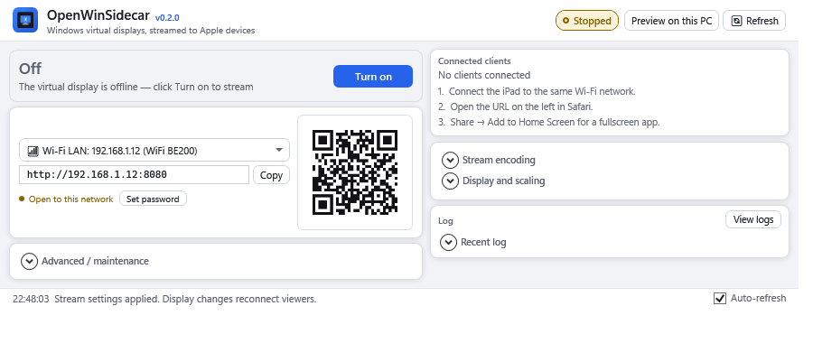

# OpenWinSidecar

I wanted to use my iPad as a second screen for my PC. The options that exist are subscription
services, or remote-desktop apps that feel like driving a car through a letterbox. So I built
the thing I wanted instead: a Windows virtual display, streamed to Safari on an iPad as
hardware-encoded HEVC, with touch and keyboard input going back the other way.

No client app. No account. No subscription. Open a URL in Safari and it works.



---

## What it actually does

- **Creates a real virtual monitor** on Windows via an IddCx driver, so Windows treats it as a
  second display — you can drag windows onto it, set its resolution and refresh rate, and pick
  it per-app.
- **Streams it as hardware HEVC** (H.265) through Intel QuickSync, decoded in hardware by the
  iPad's Apple Silicon. No transcode, no CPU.
- **Sends touch, clicks, scroll, right-click and keyboard back**, including the iPad's virtual
  keyboard.
- **Ships as a Windows installer** and is on winget.

There is deliberately **no audio**. If something plays on the PC, the iPad stays silent.

---

## Measured performance

I would rather show you numbers I actually measured than round ones. These are from an iPad Air
on the same Wi-Fi, streaming a 2360×1640 virtual display, with the encoder tuned for fluidity
over sharpness:

| | |
|---|---|
| Glass-to-glass latency | **~65 ms flat** (was ~150 ms with spikes to 1.4 s before tuning) |
| Presented frame rate | **40–46 fps** on motion, 60 fps windows on a static desktop |
| Encoder bitrate | ~10 Mbps at 2360×1640 |
| Capture | DirectX Desktop Duplication, GPU-side, with a GDI fallback |
| Codec | HEVC / `hevc_qsv`, 8-bit or 10-bit |

Two honest caveats:

- **Presented fps is not received fps.** The server can push 55+ fps that the panel never shows.
  Every number above is what the iPad actually painted.
- **I have only tested this on Intel.** NVENC and AMD AMF support is written but unvalidated —
  I have no hardware to test it on. If you have one, I would genuinely like a report.

---

## Tested configuration

| | |
|---|---|
| Host | Windows 11, Intel GPU with QuickSync (tested on Arc) |
| Client | iPad Air (4th/5th gen) and iPad Pro, Safari |
| Network | Same Wi-Fi, 5 GHz preferred |
| Permissions | **Administrator required** — the display driver and GPU capture both need it |

**It has not been tested on AMD or NVIDIA GPUs, on Windows 10, or on any browser other than
Safari.** If you try it on something else and it works — or does not — please
[open an issue](https://github.com/julianmb/OpenWinSidecar/issues). I am one person with one
test rig, and community testing on other hardware is genuinely how this gets better.

---

## Install

**From winget** (recommended):

```powershell
winget install Julianmb.OpenWinSidecar
```

**Manually:** download `OpenWinSidecar-Setup-<version>.exe` from the
[releases page](https://github.com/julianmb/OpenWinSidecar/releases), verify the SHA-256 in the
release notes, and run it. The installer is not code-signed, so SmartScreen will warn — choose
**More info → Run anyway** after checking the hash.

Then install FFmpeg, which is what drives the hardware encoder:

```powershell
winget install Gyan.FFmpeg
```

Without FFmpeg the app still works, but it falls back to JPEG at several times the bitrate, and
the dashboard will tell you so.

Launch it, leave the display on, and open the URL it shows (or scan the QR code) in Safari on
your iPad. **Share → Add to Home Screen** gives you a borderless app with no browser chrome —
that is the intended way to use it.

> Set an access password from the dashboard before using this on any network you do not fully
> control. See [SECURITY.md](SECURITY.md) — by default the server is open to your LAN.

---

## Building from source

```powershell
git clone https://github.com/julianmb/OpenWinSidecar
cd OpenWinSidecar
dotnet build OpenWinSidecar.slnx
dotnet test tests/OpenWinSidecar.Service.Tests/OpenWinSidecar.Service.Tests.csproj
node --test tests/viewer.runtime.test.cjs
& src\OpenWinSidecar\bin\Debug\net10.0-windows\OpenWinSidecar.exe   # run elevated
```

Requires the .NET 10 SDK and Node (for the viewer tests).

---

## How it fits together

```
OpenWinSidecar/
├── src/
│   ├── OpenWinSidecar.Core/      # IddCx driver management, display topology, settings
│   ├── OpenWinSidecar.Service/   # capture, HEVC encoding, HTTP/WebSocket server, viewer
│   ├── OpenWinSidecar/           # WPF dashboard + tray app  ← start here
│   └── OpenWinSidecar.Cli/       # command-line control
├── drivers/VDD/                  # signed IddCx virtual display driver
├── installer/                    # Inno Setup script
├── ios/                          # optional native Swift client (compiles in CI, unverified)
├── winget/                       # winget-pkgs manifests
└── docs/                         # architecture, troubleshooting, release operations
```

The viewer is a single self-contained `index.html` served from the app — no build step, no
framework, no bundler. It uses WebCodecs, which is why Safari and a secure context matter.

See [docs/](docs/) for architecture, network and discovery notes, troubleshooting, and how
releases work.

---

## Things I know are missing

Rather than have you find out:

- **No zoom.** Small text on the remote screen is hard to read and there is no pinch or
  magnifier. This is the biggest gap.
- **No audio.**
- **No clipboard sync** — you can type into the PC but cannot copy text back out.
- **No way to get text off the remote screen** at all.
- **Only Intel is validated.** NVENC/AMF are written but untested.
- **The native iOS app is unverified.** It compiles in CI; I do not recommend it over Safari.
- **No TLS.** Traffic is plain HTTP, so do not use this on an untrusted network.

`docs/future-work.md` tracks all of this, including the things I tried that did not work.

---

## Contributing

Issues and pull requests are welcome — especially reports from hardware I do not have. See
[CONTRIBUTING.md](CONTRIBUTING.md) for the release process.

## License

GNU Affero General Public License v3.0. See [LICENSE](LICENSE).

The viewer links back here under AGPL §13. If you modify it and let others use it over a
network, you owe them your source — that is the deal, and I am fine with it.
