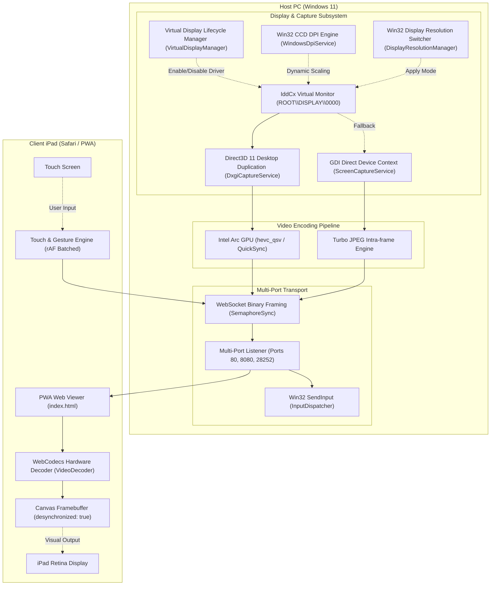

# OpenWinSidecar Technical Architecture

## 1. System Architecture Overview

OpenWinSidecar is built around a low-latency, hardware-accelerated pipeline designed to minimize glass-to-glass latency from the host Windows desktop to the client iPad or tablet.



---

## 2. Core Subsystems

### 2.1 Smart 3rd Screen Power Lifecycle (`VirtualDisplayManager` & `SpacedeskManager`)
- **Driver Enablement / Disablement**: Manages device node `ROOT\DISPLAY\0000` via `pnputil.exe` and `devcon.exe`.
- **Automated Workflow**:
  - `EnableVirtualDisplayAndStartService()`: Enables driver, extends Windows desktop via `displayswitch.exe /extend` and `SetDisplayConfig`, and starts the streaming server.
  - `DisableVirtualDisplayAndStopService()`: Stops the streaming server and disables the driver so Windows desktop cleans up without leaving orphaned windows.
  - `CompleteShutdown()`: Terminates service processes, kills orphaned FFmpeg workers, and powers down the virtual display driver.

### 2.2 Direct3D 11 Desktop Duplication (`DxgiCaptureService`)
- Acquires frames directly from Intel Arc GPU VRAM using `IDXGIOutputDuplication`.
- Uses pinned native memory buffers with SIMD row copy, achieving **< 0.5 ms** capture latency.
- Bypasses GDI `BitBlt` and CPU `Bitmap` overhead.
- Supports dynamic cursor embedding with sub-pixel hotspot correction.

### 2.3 Intel Arc QuickSync HEVC Hardware Encoder (`HevcQsvStreamEncoder`)
- Encodes 60 FPS HEVC (H.265) video in **~3.5 ms** using Gyan FFmpeg.
- Low-latency encoder flags: `-c:v hevc_qsv -preset veryfast -g 60 -bf 0 -tune zerolatency`.
- Dynamic bitrate scaling: `50% (3,000 kbps)`, `65% (5,000 kbps)`, `80% Default (8,000 kbps)`, `90% Ultra-Crisp (12,000 kbps)`.

### 2.4 Win32 Resolution Switcher & CCD DPI Scaling (`DisplayResolutionManager` & `WindowsDpiService`)
- **Resolution Control**: Uses `EnumDisplayDevices`, `EnumDisplaySettings`, and `ChangeDisplaySettingsEx` to enumerate and switch resolutions/refresh rates dynamically per-monitor.
- **DPI Scaling**: Uses Win32 `DisplayConfigSetDeviceInfo` with `DISPLAYCONFIG_DEVICE_INFO_SET_DPI_SCALE = -4` for real-time Windows Display Scale adjustment (100% to 225%) with native sub-pixel ClearType text rendering.

### 2.5 Zero-Duplicate Cursor & Pointer Subsystem
- Suppresses browser local cursor with `html, body, #container, canvas { cursor: none !important; }`.
- Streams hardware-accurate Windows cursor directly in the video frame with zero lag or duplicate pointer artifacts.
- Supports switching between Streamed Host Cursor, Touch Tablet Mode, and Native Browser Cursor.

### 2.6 Safari & iPadOS Low-Latency Web Client (`SpacedeskTcpServer`)
- **WebCodecs:** `VideoDecoder` configured with `hardwareAcceleration: 'prefer-hardware'` and `optimizeForLatency: true`.
- **Framebuffer:** Canvas initialized with `{ desynchronized: true }` to bypass the browser compositor queue.
- **Input Batching:** `requestAnimationFrame` single-finger and two-finger gesture dispatching.
- **PWA Mode:** Fullscreen standalone web app without Safari navigation bars.

---

## 3. Fan-Out Broadcast Architecture (September 2026 refactor)

Before this refactor, every connected WebSocket client ran its **own** capture loop over *shared* capture service instances — concurrent `AcquireNextFrame` calls on one duplication object are invalid DXGI and thrash with two or more clients, and a slow client accumulated unbounded latency in its TCP buffer.

### 3.1 Data flow

```
FrameBroadcastHub (one per service)
├── DisplayCaptureProducer  (one per distinct display device, e.g. \\.\DISPLAY86)
│     ├── capture tick (~60/s): DXGI AcquireNextFrame(0) → reusable native Bitmap
│     │     ├── static desktop → no frames ever presented → GDI seed (DDB blit, 1180-wide)
│     │     └── DXGI hard-failure → GDI path, time-based retry every 2s
│     └── compose per idle sink: DrawImage crop/scale + cursor stamp → signal
└── ClientFrameSink  (one per WebSocket client)
      ├── consumer loop: WaitFrame → JPEG-encode (IntraTurbo label) or HEVC push
      └── own ffmpeg hevc_qsv process; NALs → WebCodecs packets
```

### 3.2 Threading & backpressure model
- **Producer** composes into a sink's bitmap only when the sink is idle (`Interlocked` busy-handoff): a slow client **drops frames** (drop-oldest) instead of queueing latency. No frame-buffer sharing, no refcounting — the busy flag is the lifetime guarantee.
- **Timestamps** are real capture-time microseconds from a shared `Stopwatch` (previously fabricated `frameIndex * 16666`); HEVC NAL packets dequeue the queued capture timestamp (`-bf 0` preserves order).
- **Codec labels are honest**: JPEG payload is always `codecType=0 (IntraTurbo)` even if the client asked for h264/av1; the server sends a `codec:intra` text notice when the QSV encoder cannot start so the client UI can sync.
- **Topology safety**: `EnableExtendMode()` runs once per process (re-flashing `SetDisplayConfig` per session invalidated live duplication handles with `E_INVALIDARG` and flickered all monitors).
- **Timer resolution**: `timeBeginPeriod(1)` at startup — without it the 60 FPS pacing quantizes to ~30 FPS on the default 15.6 ms scheduler tick.

### 3.3 Measured results (2560×1440 VDD → 1180-wide stream, localhost)
| Path | Before | After |
|---|---|---|
| JPEG intra, 1 client | 15–25 FPS (GDI per-client) | **57 FPS** |
| JPEG intra, 2 clients | thrashing / broken | **48 FPS each** |
| HEVC hevc_qsv | mis-sized frames (native BGRA into W×H encoder) | **49 FPS**, correct GOP, ~0.2 Mbps static |
| Capture tick | — | 0.1–3.5 ms DXGI / ~35 ms GDI (DDB) |

