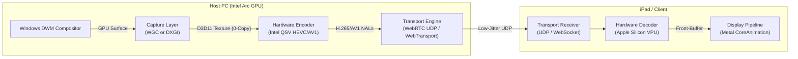

# Modern GPU-Accelerated Screen Streaming Architecture & Research

## 1. Overview & Comparative Benchmark

To achieve true **sub-15ms glass-to-glass latency** at **60–120 FPS** on 2K/Retina displays (like iPads), modern remote display solutions abandon CPU-based bitmap processing entirely in favor of an **end-to-end GPU-to-GPU zero-copy pipeline**.

---

## 2. Screen Capture Comparison (Windows 10/11)

| Capture Technology | Type | Latency | GPU Zero-Copy | Virtual Display (IddCx) Support | Permission Requirements |
|---|---|---|---|---|---|
| **Windows.Graphics.Capture (WGC)** | WinRT / D3D11 | **~0.8 – 1.5 ms** | ✅ Yes (D3D11 Texture) | ✅ **100% Native** | Standard User (No Admin required) |
| **DXGI Desktop Duplication** | DirectX 11.1 | **~1.0 – 2.0 ms** | ✅ Yes (D3D11 Texture) | ⚠️ Requires correct adapter LUID | Requires Elevation (Admin) on some virtual nodes |
| **GDI `BitBlt` / `CreateDC`** | GDI Legacy | **~25.0 – 60.0 ms** | ❌ No (CPU RAM Copy) | ✅ 100% Compatible | Standard User |

---

## 3. Hardware Video Encoding (Intel Arc & Quick Sync Video)

Intel Arc GPUs feature some of the fastest dedicated video hardware encoders available (including full hardware AV1 and HEVC):

### Encoding Frameworks:
1. **Intel OneVPL / Quick Sync Video (`h264_qsv`, `hevc_qsv`, `av1_qsv`)**:
   - Hardware encode time: **~1.2 ms** for 1080p / **~2.4 ms** for 2K (2360x1640).
   - Bitrate efficiency: HEVC / AV1 delivers crisp desktop text at only **3–6 Mbps** (vs 60 Mbps for JPEG).
2. **Windows Media Foundation (MFT)**:
   - Built-in Windows API (`ICodecAPI` with `CODECAPI_AVLowLatencyMode = true`).
   - Accepts Direct3D 11 surfaces directly from the capture API without CPU readback.
3. **FFmpeg.AutoGen / SIPSorceryMedia.FFmpeg**:
   - Clean C# wrapper configuring:
     `-vcodec hevc_qsv -preset:v ultrafast -tune:v zerolatency -b:v 6M`

---

## 4. Transport & Streaming Protocols

| Protocol | Transport | Latency | Browser (Safari) Support | Packet Loss Resilience |
|---|---|---|---|---|
| **WebRTC (MediaStream / RTP)** | UDP (DTLS/SRTP) | **~5 – 15 ms** | ✅ Native in Safari | ✅ Built-in adaptive NACK / FEC |
| **WebCodecs + WebSocket** | TCP | **~12 – 25 ms** | ✅ Native in Safari | ⚠️ Susceptible to TCP head-of-line blocking |
| **WebCodecs + WebTransport** | UDP (HTTP/3 QUIC) | **~6 – 18 ms** | ⚠️ Safari 17+ | ✅ No head-of-line blocking |
| **Moonlight GameStream** | Raw UDP | **~2 – 5 ms** | ❌ Requires native Swift App | ✅ Custom FEC |
