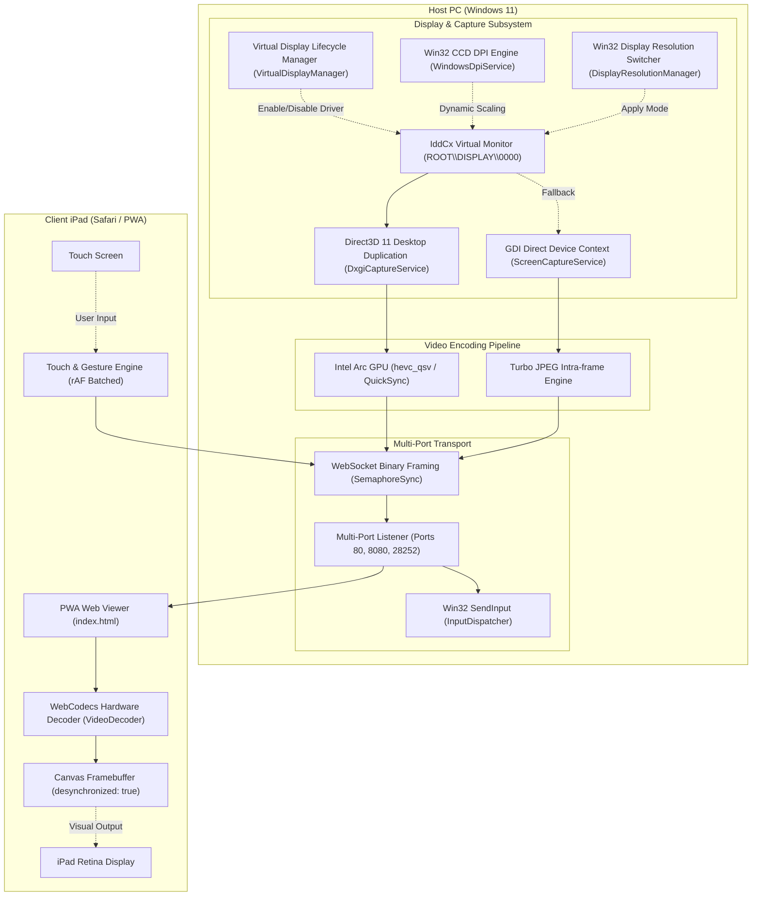

# OpenWinSidecar Technical Architecture

## 1. System Architecture Overview

OpenWinSidecar is built around a low-latency, hardware-accelerated pipeline designed to minimize glass-to-glass latency from the host Windows desktop to the client iPad or tablet.

---

## 2. Core Subsystems

### 2.1 Smart 3rd Screen Power Lifecycle (`VirtualDisplayManager` & `SidecarManager`)
- **Driver Enablement / Disablement**: Manages device node `ROOT\DISPLAY\0000` via `pnputil.exe` and `devcon.exe`.
- **Automated Workflow**:
  - `EnableVirtualDisplayAndStartService()`: Enables driver, extends Windows desktop via `displayswitch.exe /extend` and `SetDisplayConfig`, and starts the streaming server.
  - `DisableVirtualDisplayAndStopService()`: Stops the streaming server and disables the driver so Windows desktop cleans up without leaving orphaned windows.
  - `CompleteShutdown()`: Terminates service processes, kills orphaned FFmpeg workers, and powers down the virtual display driver.

### 2.2 Direct3D 11 Desktop Duplication (`DxgiCaptureService`)
- Acquires frames directly from Intel Arc GPU VRAM using `IDXGIOutputDuplication`.
- Uses pinned native memory buffers with SIMD row copy, achieving **< 0.5 ms** capture latency.
- Bypasses GDI `BitBlt` and CPU `Bitmap` overhead.
- Supports dynamic cursor embedding with sub-pixel hotspot correction.

### 2.3 Intel Arc QuickSync HEVC Hardware Encoder (`HevcQsvStreamEncoder`)
- Encodes 60 FPS HEVC (H.265) video in **~3.5 ms** using Gyan FFmpeg.
- Low-latency encoder flags: `-c:v hevc_qsv -preset veryfast -g 60 -bf 0 -tune zerolatency`.
- Dynamic bitrate scaling: `50% (3,000 kbps)`, `65% (5,000 kbps)`, `80% Default (8,000 kbps)`, `90% Ultra-Crisp (12,000 kbps)`.

### 2.4 Win32 Resolution Switcher & CCD DPI Scaling (`DisplayResolutionManager` & `WindowsDpiService`)
- **Resolution Control**: Uses `EnumDisplayDevices`, `EnumDisplaySettings`, and `ChangeDisplaySettingsEx` to enumerate and switch resolutions/refresh rates dynamically per-monitor.
- **DPI Scaling**: Uses Win32 `DisplayConfigSetDeviceInfo` with `DISPLAYCONFIG_DEVICE_INFO_SET_DPI_SCALE = -4` for real-time Windows Display Scale adjustment (100% to 225%) with native sub-pixel ClearType text rendering.

### 2.5 Zero-Duplicate Cursor & Pointer Subsystem
- Suppresses browser local cursor with `html, body, #container, canvas { cursor: none !important; }`.
- Streams hardware-accurate Windows cursor directly in the video frame with zero lag or duplicate pointer artifacts.
- Supports switching between Streamed Host Cursor, Touch Tablet Mode, and Native Browser Cursor.

### 2.6 Safari & iPadOS Low-Latency Web Client (`SidecarTcpServer`)
- **WebCodecs:** `VideoDecoder` configured with `hardwareAcceleration: 'prefer-hardware'` and `optimizeForLatency: true`.
- **Framebuffer:** Canvas initialized with `{ desynchronized: true }` to bypass the browser compositor queue.
- **Input Batching:** `requestAnimationFrame` single-finger and two-finger gesture dispatching.
- **PWA Mode:** Fullscreen standalone web app without Safari navigation bars.
